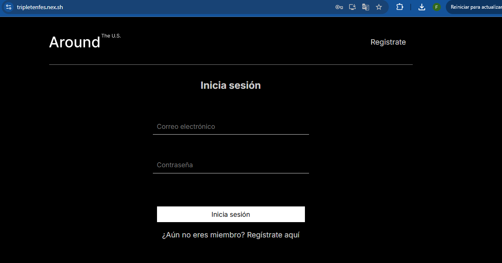
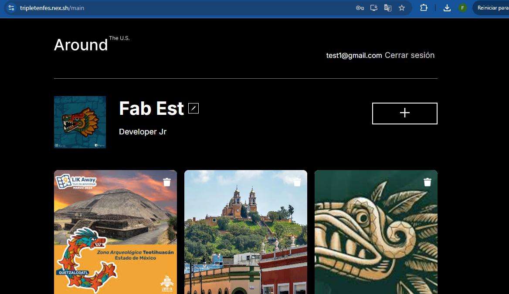
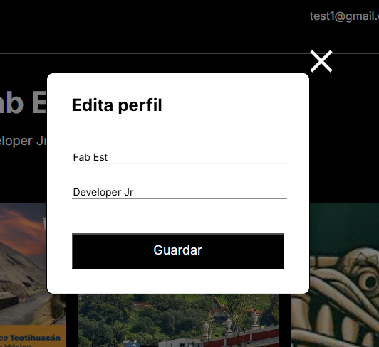
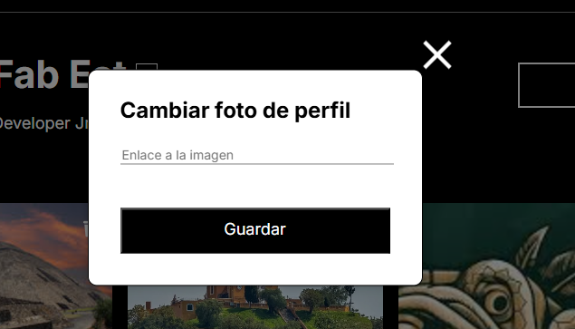
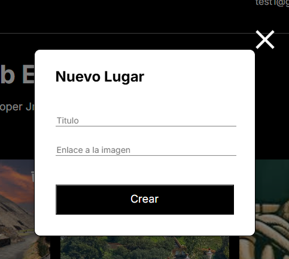
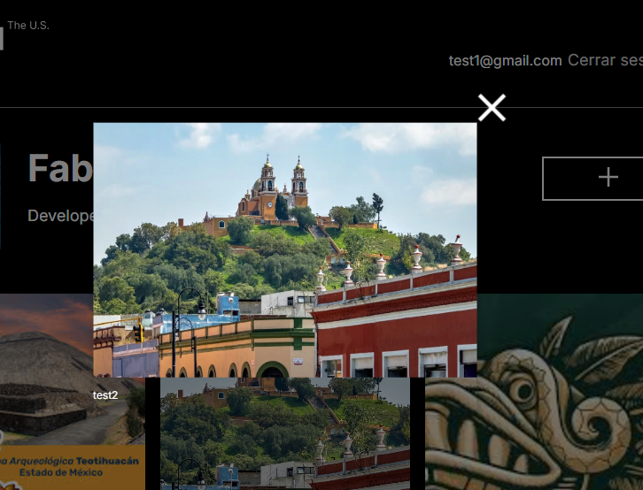
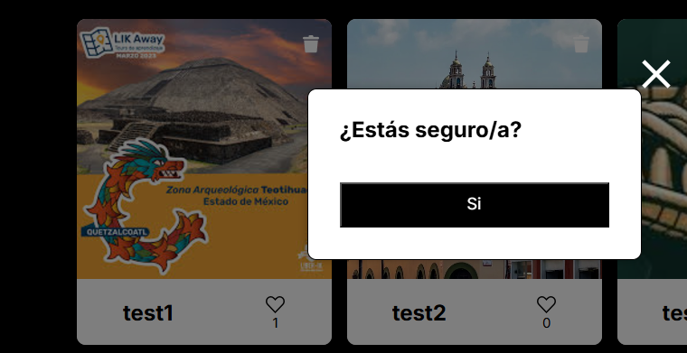
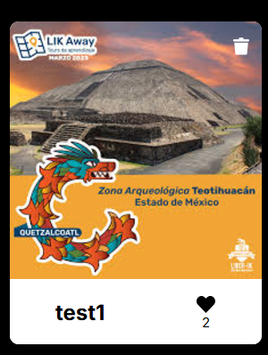
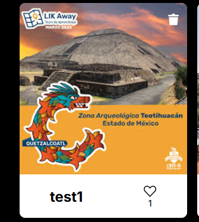

# Proyecto around (Monorepo)

Es un proyecto para poder visualizar las fotos de cualquier hobbie, banda, lugares que tengas para ti, es similar a un instagram. Se puede editar el perfil, agregar y darle me gusta a las fotos.

# Motivación

Actualmente cada usuario busca mostrar un poco mas de si mism@ através de redes sociales por lo que se genera este proyecto orientado a mostrar
hobbies, lugares que gustan al usuario, bandas de rock, etc.. con la finalidad de que otros usuarios den like a sus fotos.

Proyecto MonoRepo donde se genera el registro y autenticación para entrar al perfil y
visualizar las cartas creadas por usuarios.

# Caracteristicas del proyecto

Contiene un set de cartas con imagenes del usuario. Perfil editable. Nombre y Descripción general del usuario editables. Agregar cartas. Borrar cartas. Contador de likes.

# Tecnologías y técnicas utilizadas

Proyecto generado con HTML 5, css, react conectando a una bd mongodb.
Se realiza el desarrollo usando programación orientada a objetos.

# Proceso del proyecto
1. Análisis del requerimiento.
2. Diseño de maquetación.
3. Implementación de código.
4. Pruebas.
5. Vobo usuario.

# Resultados
Este proyecto final tiene como resultado el mostrar una página web con las caracteristicas antes descritas y asi el usuario pueda usarla para mostrar sus imagenes favoritas con un nickname, descripción.

# Instrucciones para reproducir proyecto
1. Clonar repositorio.
2. Te situas en la carpeta de front end
3. Abrir en un IDE como Visual code.
4. para descargar dependencias: npm install
5. para ejecutar: npm dev / npm run
6. para construir carpeta dist: npm run build
7. Te situas en la carpeta de backend
8. Para descargar dependencias: npm install
9. Para ejecutar: npm start

# Imágenes

# pantalla inicio

# pantalla del menú principal

# pantalla de edición de perfil

# pantalla de cambio de foto

# pantalla de agregar tarjeta

# pantalla de visualizacion de tarjeta

# pantalla eliminación tarjeta

# pantalla de likes y dislikes

# URL de la App.

https://tripletenfes.nex.sh/
