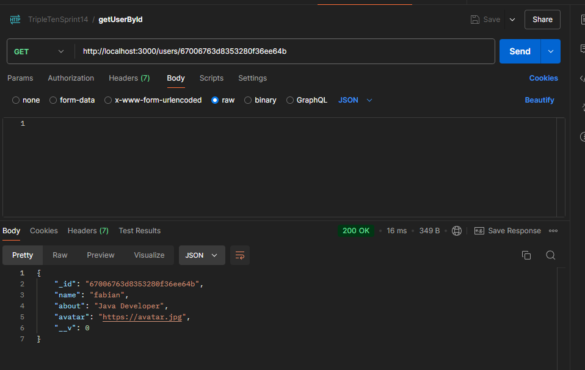
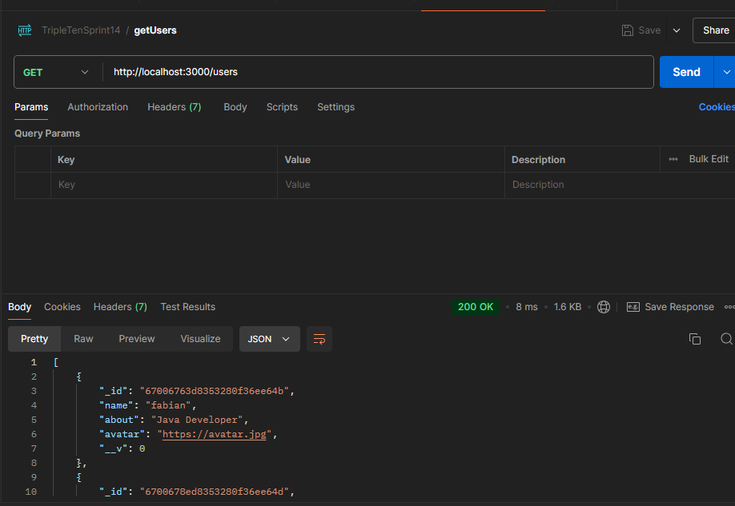
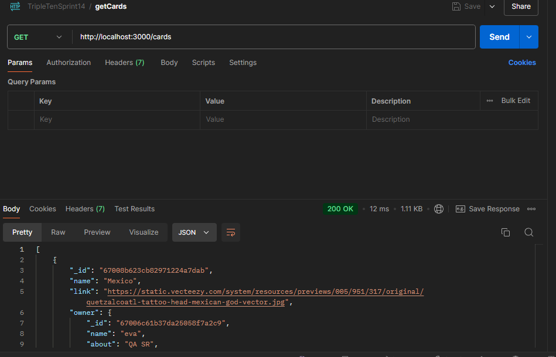
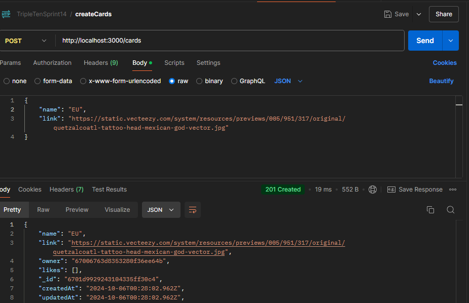

# Tripleten Project Around Express

Es un proyecto backend que obtiene los datos necesarios para mostrar cartas e información del usuario.

# Tecnologías usadas en este proyecto

javascript, eslint, mongoDB

# Evidencias de pruebas en postman

# Pruebas buscando un solo usuario

# Prueba para obtener todos los usuarios

# Prueba para obtener todas las cartas

# Prueba para crear cartas

# Pasos para levantar

1 Hacer npm install en la ruta /backend
2 ejecutar npm run dev
